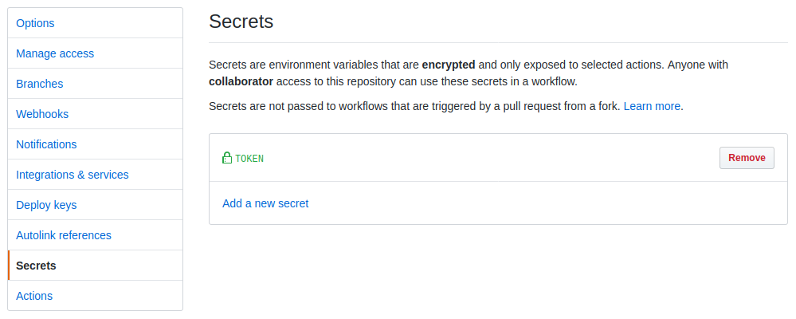

# GitHub Action to build and deploy a Hugo site to a remote repository 🚀

If you've ever wanted to keep your Hugo site source repository private, but deploy the site to your public GitHub Pages repository, you're in the right place.

This action cleans and rebuilds your [Hugo site](https://gohugo.io/), and pushes the new build to a remote repository you define.

It always uses the latest extended version from [Hugo releases](https://github.com/gohugoio/hugo/releases). The extended version [enables the processing](https://gohugo.io/troubleshooting/faq/#i-get-tocss--this-feature-is-not-available-in-your-current-hugo-version) of SCSS and Sass files to CSS.

To save build time, the action first checks that you have a valid configuration file in the repository root. See documentation for Hugo's [Configuration File](https://gohugo.io/getting-started/configuration/#configuration-file).

Your site will build in the `DEST` directory you specify (Hugo's usual default is `public`). The contents of this directory will then be pushed to `master` of your remote public repository.

## Use this in your workflow

Here's how to use this action in your workflow file.

### 1. Add a Personal Access Token as a Secret called `TOKEN` in your repository

See [Creating a token](https://help.github.com/en/github/authenticating-to-github/creating-a-personal-access-token-for-the-command-line#creating-a-token) to set up a Personal Access Token. See [Creating and storing encrypted secrets](https://help.github.com/en/actions/configuring-and-managing-workflows/creating-and-storing-encrypted-secrets) for instructions to add this to your repository.

When you're finished, your repository's Secrets tab will look like this:



### 2. Set your environment variables and add this action in a workflow

This action expects variables for:

- `REMOTE`, your remote repository in the format `<username>/<repository name>.git`,
- `DEST`, the name of the destination directory you would like the site to build to,
- `TOKEN`, in the form `${{ secrets.TOKEN }}` assuming `TOKEN` is the name you've used.

See `env` in the below example for how to set these in your workflow YAML file.

You can optionally set an environment variable `HUGO_ARGS` under the "Build and deploy" step. This allows passing one or more arbitrary [options](https://gohugo.io/commands/hugo/#options) to the `hugo` build command. See `man hugo` on your system for options. Some examples include:

- `HUGO_ARGS: '--minify'`
- `HUGO_ARGS: '--enableGitInfo --ignoreCache'`

Here is an example workflow file that uses this action on any `push` event to the `master` branch:

```yml
name: hugo-remote

on:
  push:
    branches:
      - master

env:
  REMOTE: username/username.github.io.git
  DEST: public
  TOKEN: ${{ secrets.TOKEN }}

jobs:
  build:

    runs-on: ubuntu-latest

    steps:
      - name: 🛎 Check out master
        uses: actions/checkout@master
        with:
          fetch-depth: 1
          # if your chosen Hugo theme is a submodule
          submodules: true
      - name: 🚀 Build and deploy
        env:
          HUGO_ARGS: '--minify --cleanDestinationDir'
        uses: victoriadrake/hugo-remote@master
```

You can customize branch names in your configuration. Here is an example workflow file that uses this action on any `push` event to the `master` branch and deploys to the remote repository's `main` branch:

```yml
name: hugo-remote

on:
  push:
    branches:
      - master

env:
  REMOTE: username/username.github.io.git
  DEST: public
  TOKEN: ${{ secrets.TOKEN }}

jobs:
  build:

    runs-on: ubuntu-latest

    steps:
      - name: 🛎 Check out master
        uses: actions/checkout@master
        with:
          fetch-depth: 1
          # if your chosen Hugo theme is a submodule
          submodules: true
      - name: 🚀 Build and deploy
        uses: victoriadrake/hugo-remote@master
        with:
          branch: main
```

See full instructions for [Configuring and managing workflows](https://help.github.com/en/actions/configuring-and-managing-workflows).

For workflow file syntax, see [Workflow syntax for GitHub Actions](https://help.github.com/en/actions/automating-your-workflow-with-github-actions/workflow-syntax-for-github-actions).
